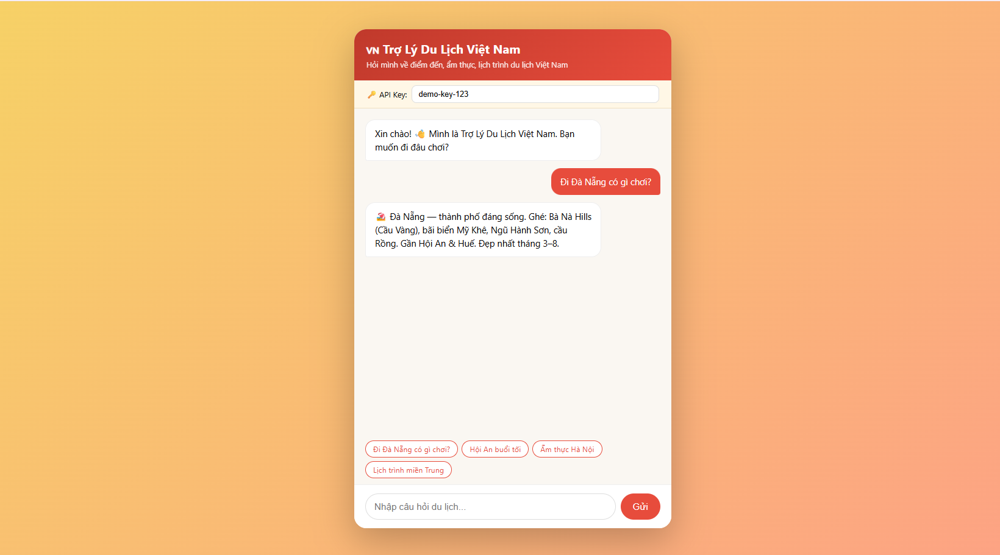
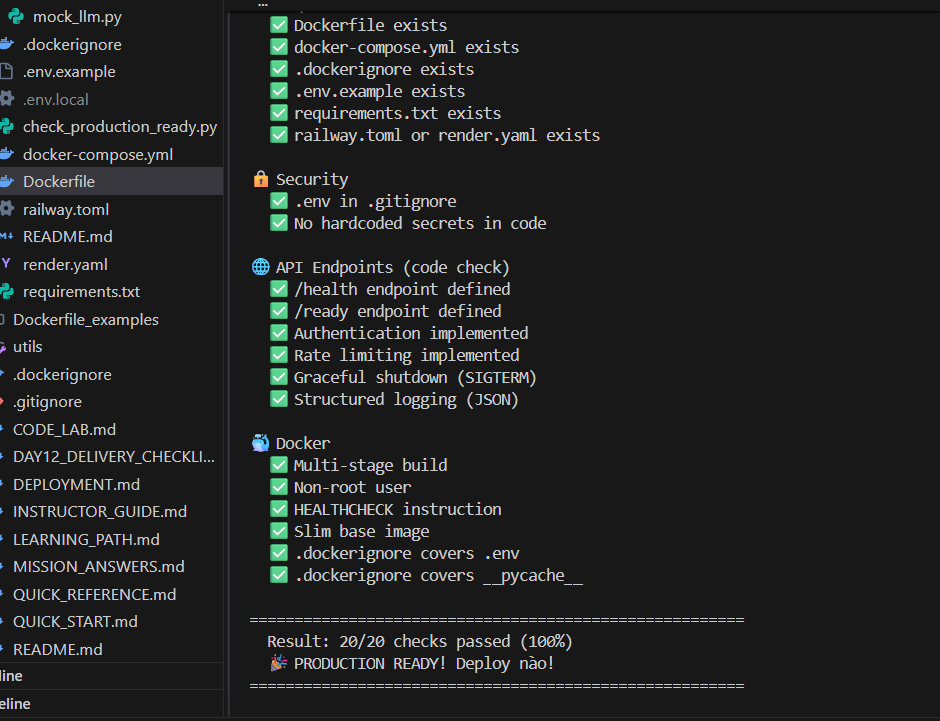
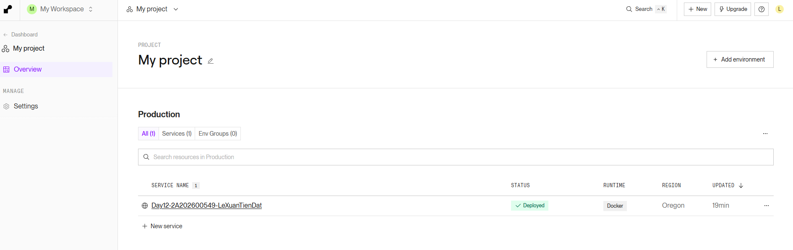

# Deployment Information

> **Project:** Trợ Lý Du Lịch Việt Nam 🇻🇳 (AI Agent có giao diện chat)
> **Sinh viên:** Lê Xuân Tiến Đạt — 2A202600549

---

## Public URL

🔗 **https://day12-2a202600549-lexuantiendat.onrender.com**

Mở trực tiếp trên trình duyệt sẽ thấy **giao diện chat** — hỏi về điểm đến, ẩm thực, lịch trình du lịch Việt Nam.

> ⚠️ Gói Free của Render **ngủ khi không có traffic** → lần truy cập đầu tiên có thể đợi ~50 giây để "đánh thức" instance. Sau đó phản hồi nhanh bình thường.

## Platform

**Render** — Web Service, runtime **Docker** (build từ Dockerfile multi-stage), gói **Free**, region Singapore. Root Directory: `06-lab-complete`.

*(Ban đầu thử Railway nhưng tài khoản bị giới hạn đòi gắn thẻ thanh toán, nên chuyển sang Render free.)*

## Environment Variables đã set trên Render

| Key | Value | Ý nghĩa |
|-----|-------|---------|
| `ENVIRONMENT` | `production` | Bật chế độ production (fail-fast nếu thiếu secret) |
| `AGENT_API_KEY` | `demo-key-123` | Key xác thực client (UI điền sẵn) |
| `JWT_SECRET` | `travel-agent-secret-2026` | Secret bắt buộc khi production |
| `RATE_LIMIT_PER_MINUTE` | `10` | Giới hạn 10 request/phút/key |
| `PORT` | *(Render tự cấp)* | App đọc qua `$PORT` |

> `.env` / `.env.local` **không commit** lên Git (nằm trong `.gitignore`); chỉ có `.env.example` làm template.

---

## Test Commands

### 1. Health check
```bash
curl https://day12-2a202600549-lexuantiendat.onrender.com/health
# Kỳ vọng: {"status":"ok","environment":"production",...}
```

### 2. Readiness check
```bash
curl https://day12-2a202600549-lexuantiendat.onrender.com/ready
# Kỳ vọng: {"ready":true}
```

### 3. Auth bắt buộc (không key → 401)
```bash
curl -i -X POST https://day12-2a202600549-lexuantiendat.onrender.com/ask \
  -H "Content-Type: application/json" \
  -d '{"question":"Da Nang"}'
# Kỳ vọng: HTTP 401 Unauthorized
```

### 4. Có key → 200 + câu trả lời
```bash
curl -X POST https://day12-2a202600549-lexuantiendat.onrender.com/ask \
  -H "X-API-Key: demo-key-123" \
  -H "Content-Type: application/json" \
  -d '{"question":"Đi Đà Nẵng có gì chơi?"}'
# Kỳ vọng: HTTP 200 + answer về Đà Nẵng
```

### 5. Rate limiting (spam > 10 lần → 429)
```bash
for i in $(seq 1 15); do
  curl -s -o /dev/null -w "%{http_code}\n" -X POST \
    https://day12-2a202600549-lexuantiendat.onrender.com/ask \
    -H "X-API-Key: demo-key-123" -H "Content-Type: application/json" \
    -d '{"question":"test"}'
done
# Kỳ vọng: 10 dòng 200, rồi 429
```

---

## Endpoints

| Method | Path | Mô tả | Auth |
|--------|------|-------|------|
| GET | `/` | Giao diện chat (HTML) | Không |
| GET | `/info` | Thông tin app (JSON) | Không |
| POST | `/ask` | Hỏi trợ lý du lịch | **X-API-Key** |
| GET | `/health` | Liveness probe | Không |
| GET | `/ready` | Readiness probe | Không |
| GET | `/metrics` | Metrics cơ bản | **X-API-Key** |
| GET | `/docs` | Swagger UI | Không |

---

## Screenshots

### 1. Giao diện chat trên URL public
Hỏi "Đi Đà Nẵng có gì chơi?" → agent trả lời đúng.



### 2. Production Readiness Check — 20/20 (100%)



### 3. Render dashboard — service Deployed (Live)


